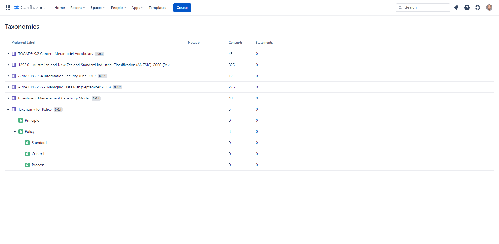
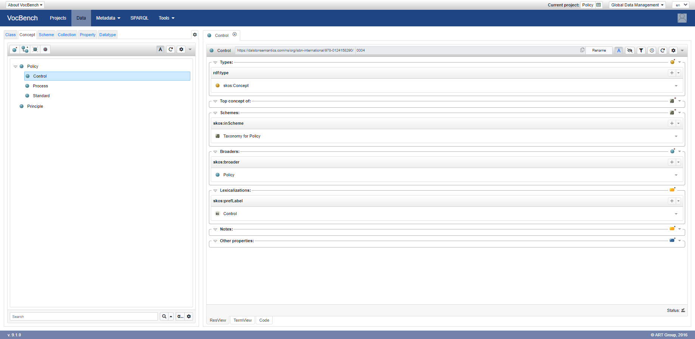

# Policy Taxonomy

This taxonomy is built with [Simple Knowledge Organization System (SKOS)](https://www.w3.org/2004/02/skos/). Data from John Ladley [(2012, Figure 2-5, Data Governance, Morgan Kaufmann)](https://learning.oreilly.com/library/view/data-governance/9780124158290/xhtml/CHP002.html#F0030).

You can use it, alongside other taxonomies outlining data quality dimensions, with [Taxonomies for Confluence](https://dalstonsemantics.com/services/taxonomies-for-confluence/) to index [Confluence](https://www.atlassian.com/software/confluence) pages and track policy coverage.

For more taxonomy tools see [Software for Controlled Vocabularies](https://github.com/gbv/bartoc.org/wiki/Software-for-controlled-vocabularies) list maintained by [BARTOC](https://bartoc.org/).

