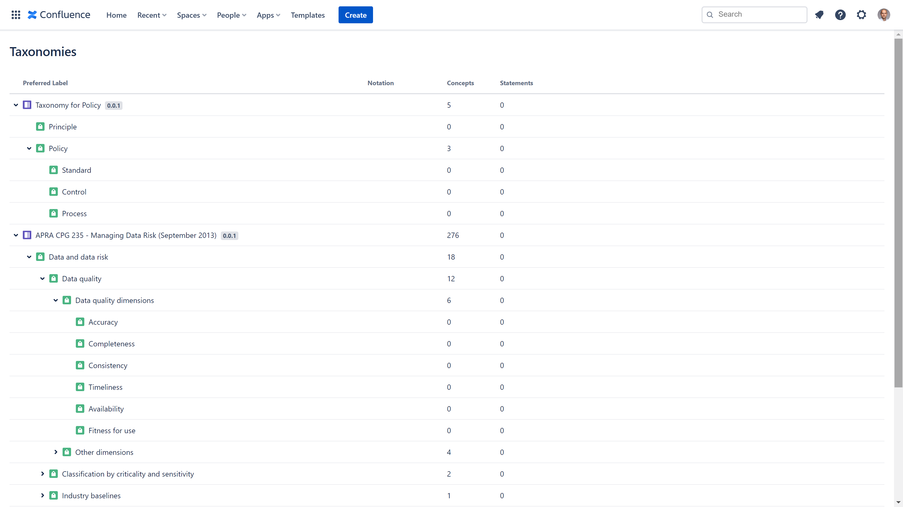

# Policy Taxonomy

This taxonomy built with [Simple Knowledge Organization System (SKOS)](https://www.w3.org/2004/02/skos/) is derived from the [Figure 2-5](https://learning.oreilly.com/library/view/data-governance/9780124158290/xhtml/CHP002.html#F0030) in Chapter 2 Definitions and Concepts of the [Data Governance](https://learning.oreilly.com/library/view/data-governance/9780124158290/) book by [John Ladley](https://www.goodreads.com/author/show/4087751.John_Ladley).

You can use it, alongside other taxonomies outlining data quality dimensions, with [Taxonomies for Confluence](https://dalstonsemantics.com/services/taxonomies-for-confluence/) to index [Confluence](https://www.atlassian.com/software/confluence) pages and track policy coverage.

